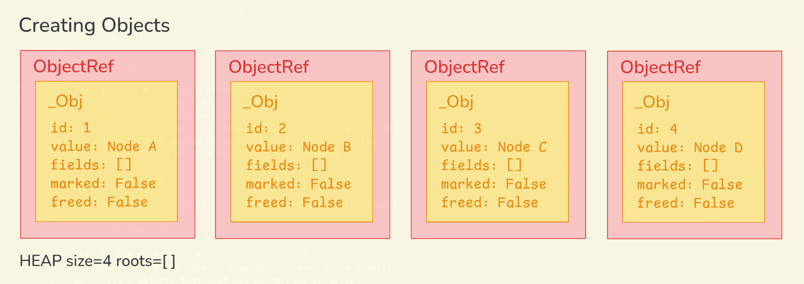
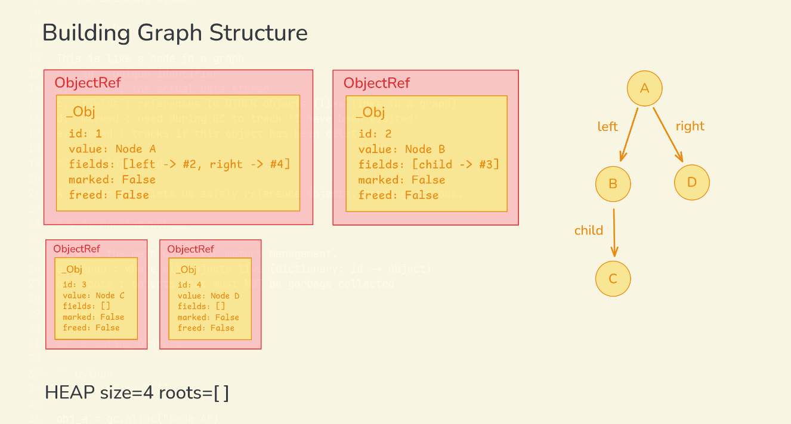
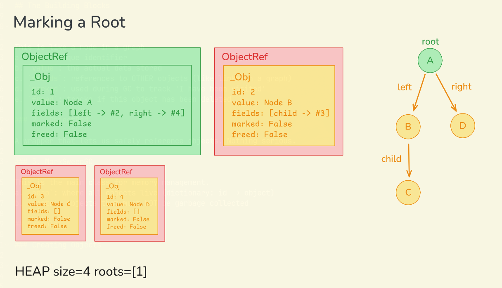
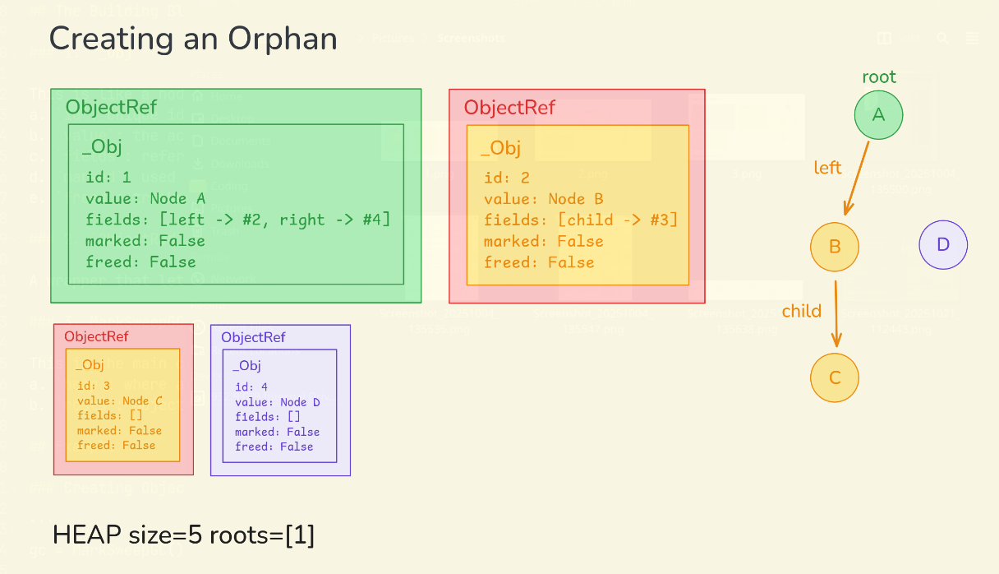
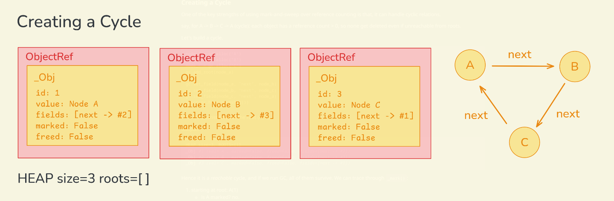
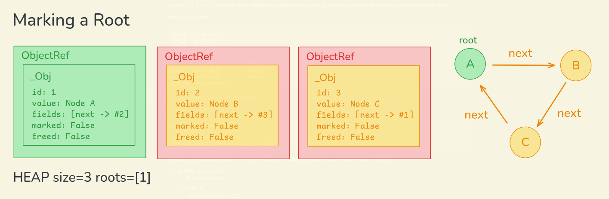
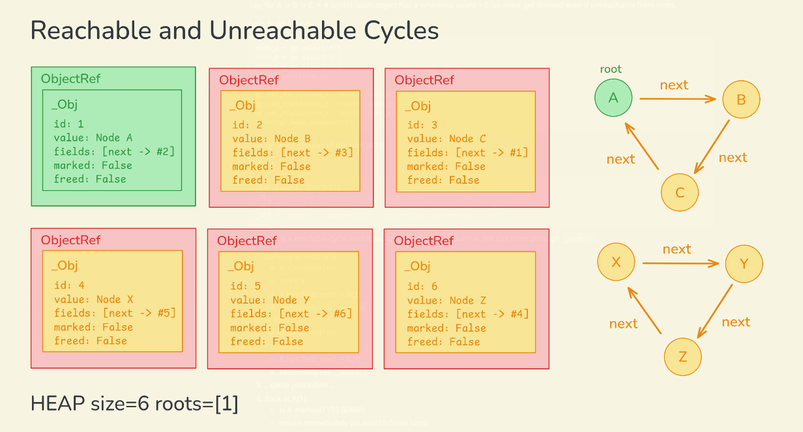

# Mark and Sweep

This garbage collector automates memory management by:

1. Marking all objects reachable from roots (like global variables)
2. Sweeping away everything that was not marked (unreachable = garbage)

## The Building Blocks

### 1. `_Obj`

This is like a node in a graph

a. `id`: unique identifier

b. `value`: the actual data stored

c. `fields`: references to OTHER objects (like links in a graph)

d. `marked`: used during GC to track 'I have been visited'

e. `freed`: tracks if this object has been deleted


### 2. `ObjectRef`

A wrapper that lets us safely reference objects. Nothing serious.

### 3. MarkSweepGC

This is the main class for memory management.

a. `heap`: where all objects live (dictionary: id -> object)

b. `roots`: objects that must NOT be garbage collected


## Example

### Creating Objects



```python
gc = MarkSweepGC()

obj_a = gc.alloc("Node A")
obj_b = gc.alloc("Node B")
obj_c = gc.alloc("Node C")
obj_d = gc.alloc("Node D")

print(gc.heap_snapshot())
```
Output:

```bash
HEAP size=4, ROOTS=[]
_Obj #1 (val='Node A', marked=False, freed=False, fields=[])
_Obj #2 (val='Node B', marked=False, freed=False, fields=[])
_Obj #3 (val='Node C', marked=False, freed=False, fields=[])
_Obj #4 (val='Node D', marked=False, freed=False, fields=[])
```
4 objects have been allocated, and each has got a unique ID (1,2,3,4)

No roots yet, that means everything is eligible for garbage collection.

NO fields yet too, so objects are all isolated.


### Building Graph Structure



```python
gc.set_field(obj_a, "left", obj_b)
gc.set_field(obj_a, "right", obj_d)
gc.set_field(obj_b, "child", obj_c)

print(gc.heap_snapshot())
```
Output:

```bash
HEAP size=4, ROOTS=[]
_Obj #1 (val='Node A', marked=False, freed=False, fields=[left -> #2, right -> #4])
_Obj #2 (val='Node B', marked=False, freed=False, fields=[child -> #3])
_Obj #3 (val='Node C', marked=False, freed=False, fields=[])
_Obj #4 (val='Node D', marked=False, freed=False, fields=[])
```
Still no roots, if we run GC now, EVERYTHING gets deleted.

### Marking a Root



```python
gc.add_root(obj_a)
print(gc.heap_snapshot())
```
Output:

```bash
HEAP size=4, ROOTS=[1]
... rest remain same ...
```
Now object #1 (A) is a root. It's like saying "this is a global variable, don't delete it".

### First Garbage Collection

```python
gc.gc()
print(gc.heap_snapshot())
```
Output:

```bash
HEAP size=4, ROOTS=[1]
_Obj #1 (val='Node A', marked=False, freed=False, fields=[left -> #2, right -> #4])
_Obj #2 (val='Node B', marked=False, freed=False, fields=[child -> #3])
_Obj #3 (val='Node C', marked=False, freed=False, fields=[])
_Obj #4 (val='Node D', marked=False, freed=False, fields=[])
```
Things remain same.

What happened when we called `gc()`?

*MARK PHASE*
1. We start at root A (id=1), mark it
2. A has fields: left -> B(2) and right -> D(4)
3. Visit B, mark it. B has child -> C(3)
4. We visit C, mark it. C has no children.
5. Visit D, mark it. D has no children.

*SWEEP PHASE*
1. Check Object 1: marked? YES -> keep, reset mark
2. Check Object 2: marked? YES -> keep, reset mark
3. Check Object 3: marked? YES -> keep, reset mark
4. Check Object 4: marked? YES -> keep, reset mark

Everything reachable from root A(1) was kept.

### Creating Garbage



We create an orphan that's NOT connected to any root.
We remove the connection A -> D

```python
gc.set_field(obj_a, "right", None)
print(gc.heap_snapshot())
```
Output:

```bash
_Obj #1 (val='Node A', marked=False, freed=False, fields=[left -> #2])
_Obj #2 (val='Node B', marked=False, freed=False, fields=[child -> #3])
_Obj #3 (val='Node C', marked=False, freed=False, fields=[])
_Obj #4 (val='Node D', marked=False, freed=False, fields=[])
```
Now we do garbage collection again,

```python
gc.gc()
print(gc.heap_snapshot())
```
Output:

```bash
HEAP size=3, ROOTS=[1]
_Obj #1 (val='Node A', marked=False, freed=False, fields=[left -> #2])
_Obj #2 (val='Node B', marked=False, freed=False, fields=[child -> #3])
_Obj #3 (val='Node C', marked=False, freed=False, fields=[])
```
D is gone, just like ...

### Creating a Cycle




One of the key strengths of using mark-and-sweep over reference counting is that, it can handle cyclic relations.

say, for A -> B -> C -> A (cycle): each object has a reference count > 0, so none get deleted even if unreachable from roots.

Let's build a cycle.

```python
node_a = gc.alloc("A")
node_b = gc.alloc("B")
node_c = gc.alloc("C")
gc.add_root(node_a)

gc.set_field(node_a, "next", node_b)
gc.set_field(node_b, "next", node_c)
gc.set_field(node_c, "next", node_a)
print(gc.heap_snapshot())
```
This cycle constitutes of the root (A(1))

Output:

```bash
HEAP size=3, ROOTS=[1]
_Obj #1 (val='A', marked=False, freed=False, fields=[next -> #2])
_Obj #2 (val='B', marked=False, freed=False, fields=[next -> #3])
_Obj #3 (val='C', marked=False, freed=False, fields=[next -> #1])
```
Hence it is a _reachable_ cycle, and if we run GC, all of them survive.
We can trace through `_mark()`:

1. starting at root: A(1)
	- is A marked? no.
	- mark A
	- A has field: next -> B(2)
	- recursively call `_mark(B)`
2. at B(2)
	- is B marked? no.
	- mark B
	- B has field: next -> C(3)
	- recursively call `_mark(C)`
3. .. same procedure ..
4. Back at A(1):
	- is A marked? YES (BAM!)
	- return immediately (to avoid infinite loop)

	

Let's make an unreachable cycle, which will be collected:

```python
orphan_x = gc.alloc("X")
orphan_y = gc.alloc("Y")
orphan_z = gc.alloc("Z")

gc.set_field(orphan_x, "next", orphan_y)
gc.set_field(orphan_y, "next", orphan_z)
gc.set_field(orphan_z, "next", orphan_x)
print(gc.heap_snapshot())
```

Output:

```bash
HEAP size=6, ROOTS=[1]
_Obj #1 (val='A', marked=False, freed=False, fields=[next -> #2])
_Obj #2 (val='B', marked=False, freed=False, fields=[next -> #3])
_Obj #3 (val='C', marked=False, freed=False, fields=[next -> #1])
_Obj #4 (val='X', marked=False, freed=False, fields=[next -> #5])
_Obj #5 (val='Y', marked=False, freed=False, fields=[next -> #6])
_Obj #6 (val='Z', marked=False, freed=False, fields=[next -> #4])
```

Well, now if we run GC,
```python
gc.gc()
print(gc.heap_snapshot())
```

The unreachable cycle get's removed.

```bash
HEAP size=3, ROOTS=[1]
_Obj #1 (val='A', marked=False, freed=False, fields=[next -> #2])
_Obj #2 (val='B', marked=False, freed=False, fields=[next -> #3])
_Obj #3 (val='C', marked=False, freed=False, fields=[next -> #1])
```

*MARK PHASE*
1. We start at root A (id=1), mark it
2. A has fields: left -> B(2) and right -> C(3) (stops when hitting already-marked A(1))
3. X(4), Y(5), Z(6) are NEVER visited.

*SWEEP PHASE*
1. A, B, C all are marked, so keep.
2. X, Y, Z none of them are marked, so all three of them get deleted.

That's it.
